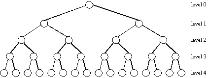

# Logarithms

_“How many times must we double up or cut in half to find the answer we’re looking for?”_

In simple terms, logarithms take big, repeated growth or shrinking and turn it into easy, small steps. This makes them super helpful for working with and understanding large amounts of information quickly.

Logarithms help us measure efficiency in algorithms by telling us how many steps it takes to reach a certain size or target.

## Sam’s Spud Search (Finding the Page Faster with Halving) 🥔📖

Imagine we’re on a mission to find the page in _The Two Towers_ where Sam talks about “po-ta-toes.” Instead of starting at page one and flipping through every page, we open the book right in the middle. If we don’t find Sam’s potato part there, we close the half where we know it can’t be and look in the middle of what’s left.

<p align="center">
</p>

We keep opening to the middle of what’s left, and every time we do, there’s less and less of the book to check. Soon, we’re down to the exact page where Sam talks about “taters.” This halving trick is what a logarithm counts—it tells we how many times we need to split the book until we find exactly what we’re looking for.

```python
def find_potato_quote(book):
    """Look for the page where Sam talks about 'po-ta-toes' in our sorted book."""

    # We’re setting up two bookmarks: one for the start and one for the end
    start_bookmark = -1  # Before the first page
    end_bookmark = len(book)  # After the last page

    # Keep looking until our two bookmarks meet
    while start_bookmark + 1 < end_bookmark:
        # Find the middle page by looking halfway between the bookmarks
        middle_page = (start_bookmark + end_bookmark) // 2
        middle_text = book[middle_page]  # See what’s on the middle page

        if middle_text == "po-ta-toes":
            return f"Yay! Found the 'po-ta-toes' on page {middle_page}!"
        elif middle_text > "po-ta-toes":
            # If the middle page comes *after* "po-ta-toes," we check the left half
            end_bookmark = middle_page
        else:
            # If it’s *before* "po-ta-toes," we check the right half
            start_bookmark = middle_page

    return "Oops! Sam's 'po-ta-toes' quote isn't in this book."

# Imagine our sorted pages (in real life, the book is much bigger!)
book_pages = ["Elves", "Gondor", "Hobbits", "Mordor", "po-ta-toes", "Ring", "Sauron"]
print(find_potato_quote(book_pages))
```

## The Power of Pages: Doubling to Victory 📖⚔️

Now, imagine we’re reading _The Two Towers_ and are completely hooked. We want to keep doubling the pages we read each time because the story is just too good to stop! First, we read one page, then two, then four, then eight—doubling every time.

But every time we double, Gandalf stands there with his mighty staff, booming, “You shall not pass… unless we can handle this!” You’ve got to double your effort to get past each “checkpoint” he guards.

This is where logarithms come in to tell us how many times we need to double our reading to get past each checkpoint until we’ve read the whole book.

```python
def how_long_to_finish_book(total_pages):
    """Calculate how many doubling steps it would take to finish a book with Gandalf's checkpoints."""
    pages_read = 1  # Start with one page
    steps = 0  # Count each doubling step

    while pages_read < total_pages:
        pages_read *= 2  # Double the pages read
        steps += 1
        print(f"Step {steps}: Gandalf says, 'You shall not pass!' until we've read {pages_read} pages.")

    return f"It would take {steps} doubling steps to finish the whole book with Gandalf’s challenges."

# Did you know? At an average reading speed of 300 WPM, it would take about 8 hours and 6 minutes.
print(how_long_to_finish_book(352))
```

Each time you double, Gandalf challenges you to see if you’re strong enough to read more pages. Logarithms help you figure out how many times you’ll need to double your reading to get past every “You shall not pass!” moment and reach the end of the book!

<p align="center">
</p>

## The Entmoot of Fangorn: Building the Ent Tree 🌳🧙‍♂️

The Ents have finally had enough of Saruman cutting down their beloved trees. They decide to hold an **Entmoot** — a meeting at Derndingle in Fangorn Forest — to discuss if they should go to war. Imagine this Entmoot growing like a **binary tree** as each Ent arrives and brings along two more Ents to support the decision.

Here’s how this works, step by step:

1. **At the Top Level** (Level 1): We have **Treebeard**, the Ent-Leader, who starts the Entmoot. He’s alone at the top, the single “root” of the Entmoot tree.
2. **At the Next Level** (Level 2): Treebeard brings **two other Ents** to the meeting to join the discussion.

3. **At the Third Level** (Level 3): Each of these two Ents brings along **two more Ents** of their own, creating a total of **4 Ents** at this level.

4. **At the Fourth Level** (Level 4): Each of those 4 Ents brings along **two more Ents**, making **8 Ents** at this level.

The Entmoot keeps growing like this, doubling at each level as more Ents get involved in the cause. Eventually, the whole forest of Ents is ready for action, fueled by the frustration of Saruman’s destruction.

<p align="center">
</p>

---

### **How Tall is the Entmoot? (Counting Levels with Logarithms)** 🌲

To figure out the “height” or **number of levels** in this Entmoot tree, we can use **logarithms** to see how many times we’d need to double the Ents until we reach the total number of Ents attending.

If we know the total number of Ents, (`n`), in the Entmoot, we can calculate the number of levels as follows:

**_Height of the Entmoot Tree = log₂(n + 1)_**

The “+1” is because we include Treebeard, the eldest, at the top level.

<p align="center">
</p>

### **Why Logarithms?** 🤔

Logarithms help us understand the **growth of the Entmoot** by counting how many “doubling” steps it takes to reach the total number of Ents. So, instead of counting individual Ents, we’re counting **how deep the gathering goes**, layer by layer, as they gather their strength for the final stand against Saruman.

In this way, the Entmoot of Fangorn Forest resembles a **binary tree**: each level doubles as more Ents join the gathering, giving us a powerful example of how binary trees grow. And with the help of logarithms, we can easily measure just how deep and mighty this forest of Ents becomes when united! 🌲

## How to Spot Logarithmic Patterns in HackerRank Problems:

| **Clue**                                                                        | **Explanation**                                                                                                                                       |
| ------------------------------------------------------------------------------- | ----------------------------------------------------------------------------------------------------------------------------------------------------- |
| **Keywords**: “sorted,” “binary search,” “balanced tree,” “efficient searching” | Problems with these keywords often require logarithmic or `O(log n)` solutions for optimal performance.                                               |
| **Halving or Doubling**                                                         | If the problem involves repeatedly halving a dataset (like binary search) or doubling growth (like in trees), logarithmic complexity may be relevant. |
| **Large Dataset with Slow Solutions**                                           | If `O(n^2)` or `O(n)` solutions are too slow, consider whether a faster `O(log n)` or `O(n log n)` approach might work.                               |

We'll go into more details about these patterns in the **Algorithm Folder** with specific examples and explanations.
